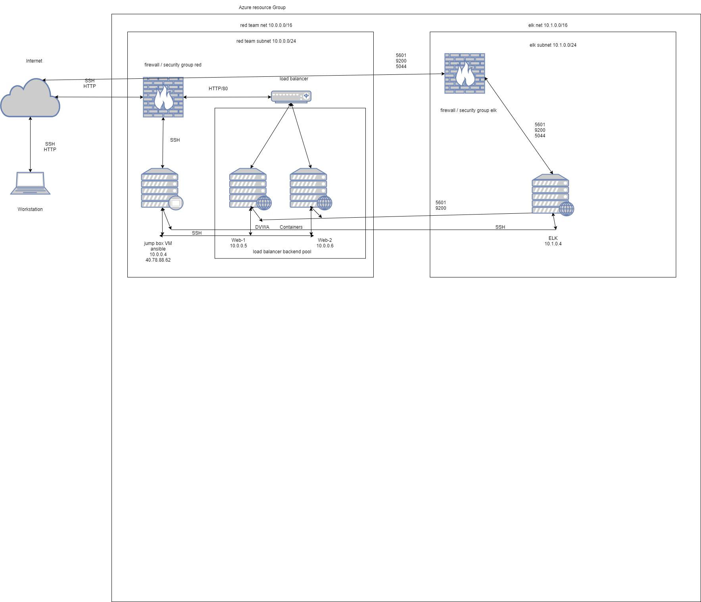

## Automated ELK Stack Deployment

The files in this repository were used to configure the network depicted below.

These files have been tested and used to generate a live ELK deployment on Azure. They can be used to either recreate the entire deployment pictured above. Alternatively, select portions of the playbook file may be used to install only certain pieces of it, such as Filebeat.

This document contains the following details:
- Description of the Topologu
- Access Policies
- ELK Configuration
  - Beats in Use
  - Machines Being Monitored
- How to Use the Ansible Build

### Description of the Topology

The main purpose of this network is to expose a load-balanced and monitored instance of DVWA, the D*mn Vulnerable Web Application.

Load balancing ensures that the application will be highly available, in addition to restricting access to the network.
- Load balancers protect against DDoS attacks, that is the availability aspect of security. 
- Additionally jump box is used for restricted access to the network.

Integrating an ELK server allows users to easily monitor the vulnerable VMs for changes to the applications and system logs.
- filebeat is used for log management.
- metricbeat is used for managing the metrics.

The configuration details of each machine may be found below.

| Name     | Function | IP Address | Operating System |
|----------|----------|------------|------------------|
| Jump Box | Gateway  | 10.0.0.4   | Linux            |
| Web1     |   DVWA   | 10.0.0.5   | Linux            |
| Web2     |   DVWA   | 10.0.0.6   | Linux            |
| ELKVM    |   ELK    | 10.1.0.4   | Linux            |

### Access Policies

The machines on the internal network are not exposed to the public Internet. 

Only the load balancer (40.83.213.240) machine can accept connections from the Internet. Access to this machine is only allowed from the following IP addresses:
- 40.78.88.62

Machines within the network can only be accessed by Jump Box.
- ELKVM ip = 10.1.0.4

A summary of the access policies in place can be found in the table below.

| Name     | Publicly Accessible | Allowed IP Addresses |
|----------|---------------------|----------------------|
| Jump Box |     No              | 24.40.75.59          |
|  Web1    |     No              | 10.0.0.4             |
|  Web2    |     No              | 10.0.0.4             |
|  Elk VM  |     No              | 10.0.0.4             |

### Elk Configuration

Ansible was used to automate configuration of the ELK machine. No configuration was performed manually.
- The main advantage of automating configuration with Ansible is, deployment is easy and fast.

The playbook implements the following tasks:
- installs Docker
- installs python3
- downloads and installs docker elk image (sebp/elk:761)

The following screenshot displays the result of running `docker ps` after successfully configuring the ELK instance.

### Target Machines & Beats
This ELK server is configured to monitor the following machines:
- 10.0.0.5
- 10.0.0.6

We have installed the following Beats on these machines:
- filebeats
- metricbeats

These Beats allow us to collect the following information from each machine:
- filebeats collects system logs
- metricbeats collects application metrics

### Using the Playbook
In order to use the playbook, you will need to have an Ansible control node already configured. Assuming you have such a control node provisioned: 

SSH into the control node and follow the steps below:
- Copy the 'hosts' and 'ansible.cfg' files to /etc/ansible.
- Update the install-elk.yml file to include [ELK]
- Run the playbook, and navigate to ansible docker container to check that the installation worked as expected.

- install-elk.yml is elk vm ansible config file, and it is copied to /etc/ansible folder.
- update 'hosts' file to have a group [ELK], and in install-elk.yml file access this as 'hosts: ELK', to specify which machine to install the ELK server on.
- 'hosts: webservers' setting is used in filebeat-playbook.yml, and metricbeat-playbook.yml to install Filebeat and Metricbeat on [webservers], Web1, and Web2.
- http://52.233.75.157:5601/app/kibana/ <- ELK server with Kibana.

